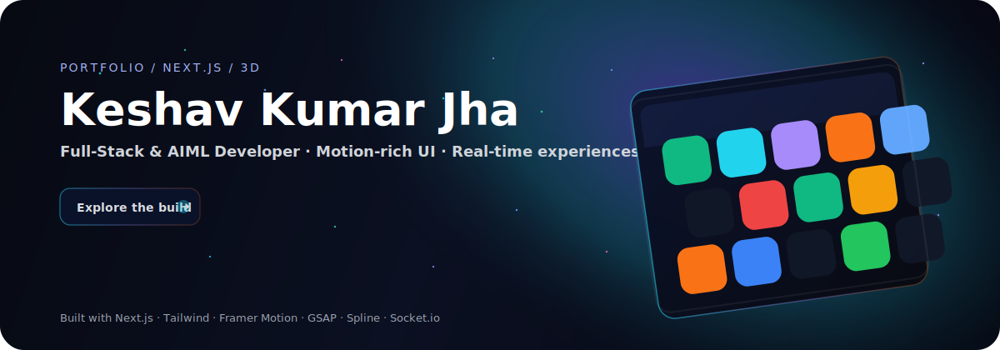
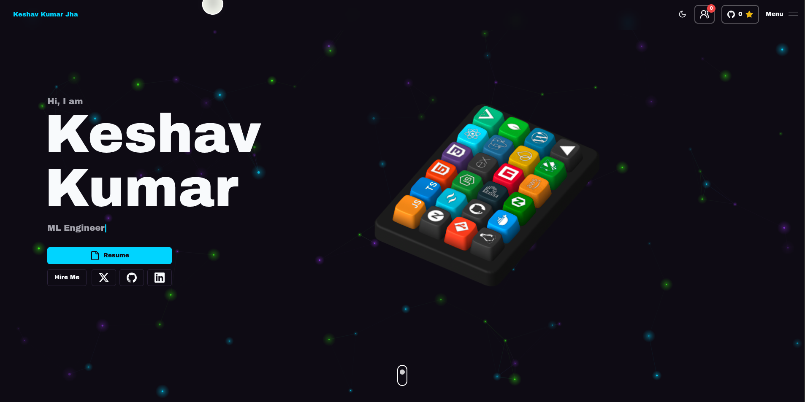
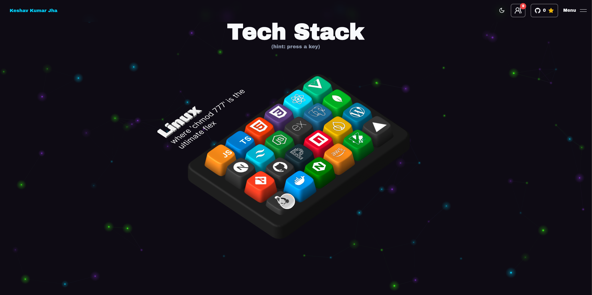
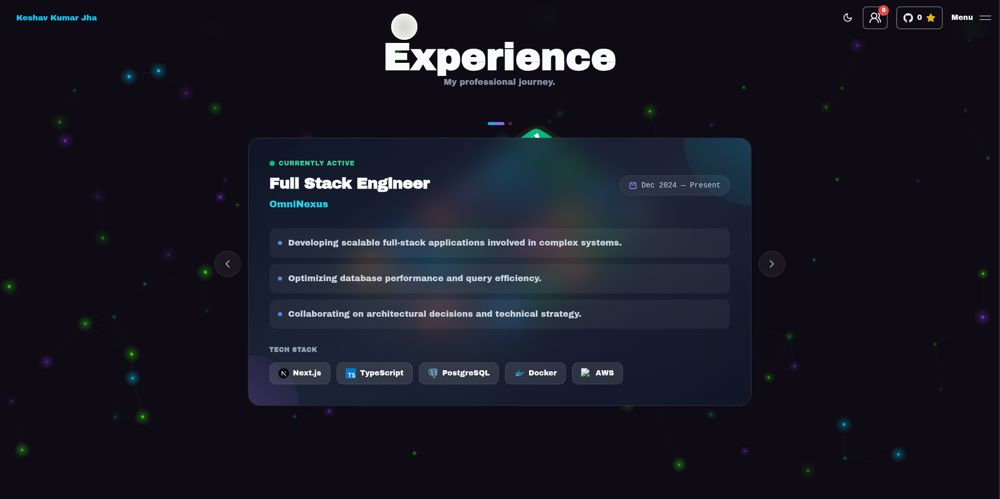

<p align="center">
  
</p>

<h1 align="center">My Portfolio Website</h1>
<p align="center">
  A motion‑rich, 3D‑flavored portfolio built with Next.js — interactive UI, smooth transitions, and a space vibe.
</p>

<p align="center">
  <a href="https://github.com/TheRealSaiTama/portfolio">Repo</a>
  ·
  <a href="https://github.com/TheRealSaiTama/portfolio/issues">Issues</a>
</p>

## Preview

<p align="center">
  
</p>

<p align="center">
  
  
</p>

## What makes it pop

- **3D UI**: Interactive Spline keyboard with “keycaps” that reveal skills/details.
- **Motion**: GSAP + Framer Motion for scroll, hover, and micro‑interactions.
- **Space theme**: Particle field + subtle glows for a cosmic feel.
- **Real‑time playground**: Socket.io powered experiments and live UI bits.
- **Responsive**: Designed to look sharp on desktop and mobile.

## Tech stack

- **Core**: Next.js, React, TypeScript, Tailwind CSS
- **UI**: shadcn/ui + custom components
- **Animation**: GSAP, Framer Motion, Spline Runtime
- **Other**: Zod, Resend, Socket.io

## Getting started

### Prerequisites

- Node.js (v18+ recommended)
- npm / pnpm / yarn

### Install & run

```bash
git clone https://github.com/TheRealSaiTama/portfolio.git
cd portfolio
npm install
npm run dev
```

Open `http://localhost:3000`.

## Scripts

- `npm run dev` — local dev server
- `npm run build` — production build
- `npm run start` — run production server
- `npm run lint` — lint (Next.js ESLint)

## Deployment

This project is designed to be deployed on Vercel:

1. Push to GitHub.
2. Import the repo in Vercel.
3. Deploy — every push triggers a redeploy.

## License

MIT — see `LICENSE`.
